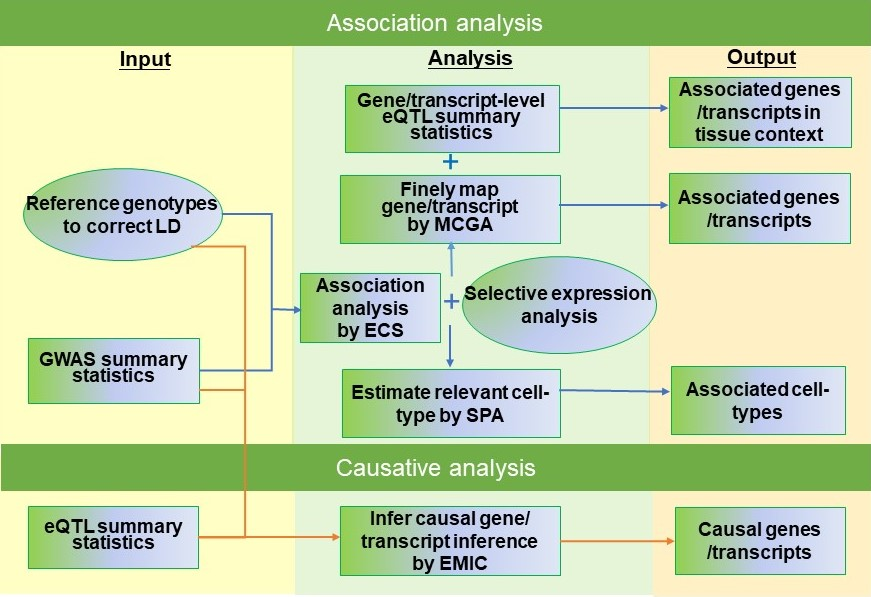

.. raw:: html

    

        KGGSEE: A biological Knowledge-based mining platform for Genomic and Genetic association Summary statistics using gEne Expression
    

.. centered:: User manual 1.0
.. centered:: Miaoxin Li, Lin Jiang

Introduction
=============

KGGSEE is a standalone Java tool for knowledge-based analyses of genomic and genetic association summary statistics of complex phenotypes by integrating gene expression and related data. It has four major integrative analyses, 1) gene-based association analysis, 2) estimation of phenotype-associated tissues or cell-type based on gene expression in single-cell or bulk cells of different tissues, 3) conditional gene-based association analysis based on multi-strategy, 4) causal gene inference for complex diseases and/or traits based-on multiple eQTL. More integrative analysis functions will be added into this analysis platform in the future.

Installation
==============

kggsee.jar
~~~~~~~~~~~~~~~

The main library of KGGSEE, kggsee.jar, does not need an installation procedure as long as its `Java Runtime Environment(JRE) v1.8 <https://www.oracle.com/java/technologies/javase-jre8-downloads.html>`_ (or up) is pre-installed in your machine. The kggsee.jar can be directly executed given a file path

R packages
~~~~~~~~~~~~~

.. note::
    However, you many need to install several R packages which will be called by kggsee.jar. The following are instructions for R package installation under the interactive working interface of R.

- Rserve

    ``install.packages(“Rserve”, dep=TRUE)``
    More installation instruction can be found at https://www.dundas.com/support/support-center/support-articles/installation/install-and-configure-r.

- NNLM

    ``install.packages(“NNLM”, dep=TRUE)``
    More installation instruction can be found at https://github.com/linxihui/NNLM.

- MendelianRandomization

    The first step is to install the PhenoScanner package(and the MendelianRandomization package if you haven't done this previously):

    .. code:: R

        install.packages("devtools")
        library(devtools)
        install_github("phenoscanner/phenoscanner")
        library(phenoscanner)

        install.packages("MendelianRandomization")
        library(MendelianRandomization)

Resource data
~~~~~~~~~~~~~~~~~~

Under the folder of kggsee, there is a folder named **resources**, which contains running resource data, e.g., gene boundary and gene expression. KGGSEE will automatically download required resource files. Users can all manually download the files and put them into the corresponding folders.

Tutorials
=========================

Gene-based association analysis
~~~~~~~~~~~~~~~~~~~~~~~~~~~~~~~~~~~~~~~~~~~~~~~~~~~~~~~~~~~~~~~~~~~~~~~~~~~~~~~~~~~~~~~~~~~

Purpose: Detect associated genes of a phenotype by GWAS summary statistics
 - Input data:
     
   1. GWAS summary statistics compressed in a text file(a fabled data set for education purpose): *examples/gwas.sum.stat.gz*
     
   2. Genotypes in VCF format to approximate correction between summary statistics: *resources/hg19/gty/1kg.phase3.v5.shapeit2.eur.hg19.chr1.vcf.gz*

.. code:: shell 

  java -Xmx10g -jar kggsee.jar \
  --nt 10 \
  --gene-assoc \
  --sum-file examples/gwas.sum.stat.gz \
  --vcf-ref resources/hg19/gty/1kg.phase3.v5.shapeit2.eur.hg19.chr*.vcf.gz \
  --keep-ref \  
  --out examples/out/geneAssoc

Estimate relevant cell-types of a phenotype
~~~~~~~~~~~~~~~~~~~~~~~~~~~~~~~~~~~~~~~~~~~~~~~~~~~~~~~~~~~~~~~~~~~~~~~~~~~~~~~~~~~~~~~~~~~
  
Purpose: Estimate relevant cell-types of a phenotype and finely map associated genes according to selective expression
 - Input data:
    
   1. GWAS summary statistics compressed in a text file(a fabled data set for education purpose): *examples/gwas.sum.stat.gz*
     
   2. Genotypes in KGGSEE objects(generated last time) to approximate correction between summary statistics: *examples/out/geneAssoc*
     
   3. Gene expression data compressed in a text file: *resources/hs_scRNA_cluster_mean.tsv.gz*
     
.. code:: shell

     java -Xmx10g -jar kggsee.jar \
     --nt 10 \
     --spa \
     --expression-file resources/hs_scRNA_cluster_mean.tsv.gz \
     --only-hgnc-gene \
     --sum-file examples/gwas.sum.stat.gz \
     --saved-ref  examples/out/geneAssoc \
     --out examples/out/spa \
     --excel
 

Multi-strategy conditional gene-based association analysis
~~~~~~~~~~~~~~~~~~~~~~~~~~~~~~~~~~~~~~~~~~~~~~~~~~~~~~~~~~~~~~~~~~~~~~~~~~~~~~~~~~~~~~~~~~~

**Purpose**: Perform conditional gene-based association analysis using different SNPs sets, i.e., physically nearby SNPs, isoQTLs and gene-level eQTLs. Three strategies correspond to three models, i.e., MCGA_Dist, MCGA_isoQTL and MCGA_eQTL.

- MCGA_Dist input data:
     
   1. GWAS summary statistics compressed in a text file (a fabled data set for education purpose): *examples/gwas.sum.stat.gz*;
     
   2. Genotypes in KGGSEE objects (generated in `Gene-based association analysis <#gene-based-association-analysis>`_) to approximate correction between summary statistics: *examples/out/geneAssoc*;
   
   3. Gene expression data compressed in a text file: *resources/gtex.v8.gene.mean.tsv.gz*.
   
  
.. code:: shell

    java -Xmx20g \
   -jar kggsee.jar \
   --nt 10 \
   --sum-file examples/gwas.sum.stat.gz \
   --chrom-col CHR \
   --pos-col BP \
   --p-col P \
   --gene-finemapping \   
   --saved-ref  examples/out/geneAssoc \
   --expression-file resources/gtex.v8.gene.mean.tsv.gz \
   --only-hgnc-gene \
   --p-value-cutoff 0.05 \
   --multiple-testing bonf \
   --out examples/out/geneAssoceQTL
   
- MCGA_isoQTL input data:
     
   1. GWAS summary statistics compressed in a text file(a fabled data set for education purpose): *examples/gwas.sum.stat.gz*;
     
   2. Genotypes in KGGSEE objects (generated in `Gene-based association analysis <#gene-based-association-analysis>`_) to approximate correction between summary statistics: *examples/out/geneAssoc*;

   3. Isoform-level expression data compressed in a text file: *resources/gtex.v8.transcript.mean.tsv.gz*;

   4. isoQTL summary statistics compressed in a text file: *resources/hg19/eqtl/Brain-FrontalCortex_BA9_.transcript.maf05.p01.gz.eqtl.txt.gz*.

.. code:: shell

   java -Xmx20g \
   -jar kggsee.jar \
   --nt 10 \
   --sum-file examples/gwas.sum.stat.gz \
   --chrom-col CHR \
   --pos-col BP \
   --p-col P \
   --gene-finemapping \
   --saved-ref  examples/out/geneAssoc \
   --expression-file resources/gtex.v8.transcript.mean.tsv.gz \
   --eqtl-file resources/hg19/eqtl/Brain-FrontalCortex_BA9_.transcript.maf05.p01.gz.eqtl.txt.gz \ 
   --filter-eqtl-p 0.01 \  
   --only-hgnc-gene \
   --p-value-cutoff 0.05 \
   --multiple-testing bonf \
   --calc-selectivity \
   --out examples/out/geneAssoceQTL

- MCGA_eQTL input data:
     
   1. GWAS summary statistics compressed in a text file(a fabled data set for education purpose): *examples/gwas.sum.stat.gz*;
     
   2. Genotypes in KGGSEE objects (generated in `Gene-based association analysis <#gene-based-association-analysis>`_) to approximate correction between summary statistics: *examples/out/geneAssoc*;
   3. Gene-level expression data compressed in a text file: *resources/gtex.v8.gene.mean.tsv.gz*;
   4. eQTL summary statistics compressed in a text file: *resources/hg19/eqtl/Brain-FrontalCortex_BA9_.gene.maf05.p01.gz.eqtl.txt.gz*.
   
   
.. code:: shell

   java -Xmx20g \
   -jar kggsee.jar \
   --nt 10 \
   --chrom-col CHR \
   --pos-col BP \
   --p-col P \
   --gene-finemapping \
   --sum-file examples/gwas.sum.stat.gz \
   --saved-ref  examples/out/geneAssoc \
   --expression-file resources/gtex.v8.gene.mean.tsv.gz \
   --eqtl-file resources/hg19/eqtl/Brain-FrontalCortex_BA9_.gene.maf05.p01.gz.eqtl.txt.gz \
   --filter-eqtl-p 0.01 \  
   --only-hgnc-gene \
   --p-value-cutoff 0.05 \
   --multiple-testing bonf \
   --out examples/out/geneAssoceQTL
 
Gene-based causality analysis
~~~~~~~~~~~~~~~~~~~~~~~~~~~~~~~~~~~~~~~~~~~~~~~~~~~~~~~~~~~~~~~~~~~~~~~~~~~~~~~~~~~~~~~~~~~

Purpose: Detect causal genes of a phenotype by GWAS summary statistics and eQTL
 - Input data:

   1. GWAS summary statistics compressed in a text file(a fabled data set for education purpose): *examples/gwas.sum.stat.gz*
   
   2. Genotypes in KGGSEE objects(generated in last time) to approximate correction between summary statistics: *examples/out/geneAssoc*
   
   3. eQTL summary statistics compressed in a text file: *resources/hg19/eqtl/Brain-FrontalCortex_BA9_.transcript.maf05.p05.gz.eqtl.txt.gz*
     
.. code:: shell  

   java -Xmx10g  -jar kggsee.jar \
   --nt 10 \
   --emic \
   --eqtl-file resources/hg19/eqtl/Brain-FrontalCortex_BA9_.transcript.maf05.p05.gz.eqtl.txt.gz \
   --sum-file examples/gwas.sum.stat.gz \
   --beta-type 2 \
   --saved-ref  examples/out/geneAssoc \
   --out examples/out/emic \
   --excel
 
 
 
Functions
=========================

Gene-based association analysis by an effective chi-square statistics(ECS)
~~~~~~~~~~~~~~~~~~~~~~~~~~~~~~~~~~~~~~~~~~~~~~~~~~~~~~~~~~~~~~~~~~~~~~~~~~~~~~~~~~~~~~~~~~~

One can perform gene-based association analysis by an effective chi-square statistics(ECS) with GWAS *p*-values of variants. The *p*-values are converted to chi-square statistics(degree of freedom = 1). The ECS merges all chi-square statistics of a gene after correcting the redundancy of the statistics due to LD. The LD is calculated from genotypes of an ancestrally matched sample in VCF format, e.g. a panel of 1000 Genomes Project. The method of ECS is described in our paper(`Paper Link <http://bing.com>`_).

Required options
----------------------

- ``--gene-assoc``
- ``--sum-file [/path/to/summary/file]``
- ``--vcf-ref [/path/to/vcf/file]``
- ``--keep-ref``
- ``[--saved-ref "previous/output/path/prefix"]``
- ``--out [output/path/prefix]``

**See an analysis example at:** `Gene-based association analysis <#gene-based-association-analysis>`_

Explanations and Optional options
--------------------------------------

- ``--gene-assoc``: The main function option.
- ``--sum-file``: The file containing GWAS summary statistics.

    Three columns of the GWAS summary statistic file, chromosome, physical position and *p*-value are minimal requirement. The default column names are CHR, BP and P respectively. Otherwise, users should specify the name by ``--chrom-col``, ``--pos-col`` and ``--p-col`` respectively.

    .. table::
        :align: center

        === ====== ======
        CHR BP     P
        === ====== ======
        1   751756 0.979957
        1   752566 0.863844
        1   752894 0.55814
        1   753405 0.968401
        1   755890 0.918246
        === ====== ======

- ``--vcf-ref``: The file containing genotypes to calculate genotypic correlations. For data separated in multiple files by chromosomes, one can use asterisk wildcard (e.g., hg19.chr*.vcf.gz) to denote the chromosome names.
- ``--keep-ref``: Save the encoded genotypes in VCF for future usage, which will speed up next analysis.
- ``--saved-ref``: Instead of using ``--vcf-ref``, one can directly specify the path of encoded genotypes last time by specifying last output path.
- ``--filter-maf-le``: Filter out variants with minor allele frequency less or equal than the specified value.
- ``--out``: Specify the path and prefix name of the output files. The main output file of the gene-based analysis is ***.gene.pvalue.txt** or ***.gene.pvalue.xls**. The following

    .. csv-table::
        :file: ./table/demo.gene.pvalue.csv
        :header-rows: 1
        :align: center

    columns in the output file are gene symbol, number of variants in the gene, *p*-values of gene-based association test, and the detailed information of the top variant within the gene(i.e., the variant with smallest *p*-value). These columns include chromosome, physical position, *p*-value, whether the top variant was ignored in the gene-based association analysis, and gene feature annotations according to RefGene and GENCODE.

Finely map genes and estimate relevant cell-types of a phenotype by the single-cell(or bulk-cell) type and phenotype cross annotation framework(SPA)
~~~~~~~~~~~~~~~~~~~~~~~~~~~~~~~~~~~~~~~~~~~~~~~~~~~~~~~~~~~~~~~~~~~~~~~~~~~~~~~~~~~~~~~~~~~~~~~~~~~~~~~~~~~~~~~~~~~~~~~~~~~~~~~~~~~~~~~~~~~~~~~~~~~~~~~~~~~~~~~~~~~~~~~~~~~~~~~~~~~~~~~~~~~~~~~~~~~~~~~~~

One can simultaneously prioritize phenotype associated genes and cell-types with GWAS *p*-values and gene/transcript expression profile. The GWAS *p*-values types and expression were analyzed by an iterative prioritization procedure. In the procedure, phenotype-associated genes were prioritized by a conditional gene-based association(using the ECS again) according to the genes’ selective expression in disease related cell-types while the phenotype related cell-types were prioritized by an enrichment analysis of Wilcoxon rank-sum test for phenotype-associated genes’ selective expression. The phenotype-associated gene list and phenotype related cell-type list were updated by turns until the two list were unchanged. The detailed method is described in our paper(`Paper Link <http://bing.com>`_).

Required options
-------------------

- ``--spa``
- ``--expression-file [path/to/expression/file]``
- ``--only-hgnc-gene``
- ``--sum-file [/path/to/summary/file]``
- ``--saved-ref  [previous/output/path/prefix]``
- ``--out [output/path/prefix]``

**See an analysis example at:** `Estimate relevant cell-types of a phenotype <#estimate-relevant-cell-types-of-a-phenotype>`_

Explanations and Optional options
----------------------------------

- ``--spa``: The main function option.
- ``--multiple-testing``: The multiple testing method to select significant genes for the conditional analysis. There are three settings. *bonf*: Standard Bonferroni correction given a family-wise error rate specified by ``--p-value-cutoff``.  *benfdr*: Benjamini-Hochberg method to control the false discovery rate. *fixed*: Filtering by a fixed *p*-value cutoff.
- ``--p-value-cutoff``: The cutoff for the multiple testing.
- ``--only-hgnc-gene``: Only consider genes with hgnc gene symbols.
- ``--expression-file``: The path of gene expression file.

    The expression file contains gene symbols(the first column), expression mean and standard errors of the gene or transcript in a cell types or clusters. One can include the Ensembl transcript ID of a gene in the first column. When a gene has multiple transcripts, each row can only contain the data of transcript. The standard error is not pre-requisite.

    .. csv-table::
        :file: ./table/gene.expression.file.csv
        :header-rows: 1
        :align: center

- ``--sum-file``: See above description. 
- ``--filter-maf-le``: See above description.
- ``--out``: Specify the path and prefix name of the output files. One of main output files is the conditional gene-based analysis results, named ***.finemapping.gene.ecs.txt** or ***. finemapping.gene.ecs.xls**. The following

    .. csv-table::
        :file: ./table/demo.finemapping.gene.ecs.csv
        :header-rows: 1
        :align: center

    columns in the output file are gene symbol, chromosome, transcription start position, transcription end position, number of variants in the gene, the LD group ID of genes, *p*-values of gene-based association test, *p*-values of conditional gene-based association test, and the selective expression score in enriched tissue or cell-types.

    Another main output files is the selective expression enrichment analysis results at different tissues or cell types, named ***.celltype.txt** or ***. celltype.xls**. The following

    .. csv-table::
        :file: ./table/demo.celltype.csv
        :header-rows: 1
        :align: center

    columns in the output file are tissue or cell-type names, the *p*-value of enrichment according to the selective expression derived from the robust regression *z*-score, the logarithm of *p*-value.

Multi-strategy Conditional Gene-based Association framework (MCGA)
~~~~~~~~~~~~~~~~~~~~~~~~~~~~~~~~~~~~~~~~~~~~~~~~~~~~~~~~~~~~~~~~~~~~~~~~

MCGA can be used to perform conditional gene-based association analysis using different SNPs sets, i.e., physically nearby SNPs, isoQTLs and gene-level eQTLs. The statistical method is the improved effective chi-square statistics(ECS). The pre-calculated cis-eQTLs/isoQTLs of gene-level and isoform(transcript)-level expression in 50 tissues or cell-types from GTEx(v8) have been integrated into KGGSEE resource (`hg19 <https://mailsysueducn-my.sharepoint.com/personal/limiaoxin_mail_sysu_edu_cn/_layouts/15/onedrive.aspx?originalPath=aHR0cHM6Ly9tYWlsc3lzdWVkdWNuLW15LnNoYXJlcG9pbnQuY29tLzpmOi9nL3BlcnNvbmFsL2xpbWlhb3hpbl9tYWlsX3N5c3VfZWR1X2NuL0VwWFJxTFhJVG9aSXRFclVIaURORE8wQmstamVpQXRJbEEtYWJHak9DZGJxRXc%5FcnRpbWU9OUt0dVZ1b0QyVWc&id=%2Fpersonal%2Flimiaoxin%5Fmail%5Fsysu%5Fedu%5Fcn%2FDocuments%2Ftools%2Fkggsee%2Fresources%2Fhg19%2Feqtl>`_ and `hg38 <https://mailsysueducn-my.sharepoint.com/personal/limiaoxin_mail_sysu_edu_cn/_layouts/15/onedrive.aspx?originalPath=aHR0cHM6Ly9tYWlsc3lzdWVkdWNuLW15LnNoYXJlcG9pbnQuY29tLzpmOi9nL3BlcnNvbmFsL2xpbWlhb3hpbl9tYWlsX3N5c3VfZWR1X2NuL0VwWFJxTFhJVG9aSXRFclVIaURORE8wQmstamVpQXRJbEEtYWJHak9DZGJxRXc%5FcnRpbWU9OUt0dVZ1b0QyVWc&id=%2Fpersonal%2Flimiaoxin%5Fmail%5Fsysu%5Fedu%5Fcn%2FDocuments%2Ftools%2Fkggsee%2Fresources%2Fhg38%2Feqtl>`_).

Required options
--------------------

- ``--gene-finemapping``
- ``--eqtl-file [path/to/eQTL/file of genes or transcripts]``
- ``--filter-eqtl-p``
- ``--expression-file [path/to/expression/file]``
- ``--sum-file [/path/to/summary/file]``
- ``--filter-maf-le``
- ``--saved-ref  [previous/output/path]``
- ``--out [output/path/prefix]``
- ``--nt``
- ``--chrom-col``
- ``--pos-col``
- ``--p-col``
- ``--only-hgnc-gene``
- ``--p-value-cutoff``
- ``--multiple-testing``
- ``--regions-out``

**See analysis examples at:** `MCGA <#mcga>`_

Explanations and Optional options
-----------------------------------

- ``--nt``: CPU cores used for the analysis.
- ``--gene-finemapping``: The main function option.
- ``--multiple-testing``: The multiple testing method to select significant genes for the conditional analysis. There are three settings. bonf: Standard Bonferroni correction. benfdr: Benjamini-Hochberg method to control the false discovery rate. fixed: Filtering by a fixed p-value cutoff.
- ``--p-value-cutoff``: The family-wise cutoff for the multiple testing..
- ``--only-hgnc-gene``: Only consider genes with HGNC gene symbols.
- ``--expression-file``: The preproceeded gene expression file. The index column of the preprocessed expression file was gene/isoform symbol name, and each of 50 tissues or cell types had two columns: one representing average expression value (i.e., mean) of all sample and the other representing the standard error of the mean (SE).

- ``--filter-eqtl-p``: a filter used to filter eQTLs/isoQTLs  < the cutoff.
- ``--sum-file``: the full path of the GWAS summary statistics. Three columns of the GWAS summary statistic file, chromosome, physical position and p-value are minimal requirement. The default column names are CHR, BP and P respectively. Otherwise, users should specify the name by ``--chrom-col``, ``--pos-col`` and ``--p-col`` respectively.
- ``--filter-maf-le``: a filer used to filter variants with MAF > the cutoff.
- ``--regions-out``: a region used to exclude variants in the specified regions.

- ``--eqtl-file``: The full path of eQTL/isoQTL file. The format of eQTL/isoQTL file is similar to the fasta file. The first row starting with "#" is the column names. The eQTL data of a gene or transcript start with the symbol “>”. In the same row, the gene symbol, Ensembl gene/transcript ID and chromosome name are included and delimited by tab characters. The subsequent row contains the summary statistics the eQTL/isoQTL for the gene or transcript. The tab-delimited columns are physical position, reference allele, alternative allele, frequency of alternative allele, estimated effect size, standard error of the estimation, *p*-value, effective sample sizes and determination coefficient in a linear regression respectively. In the regression, the number of alternative alleles is used as an independent variable. On KGGSEE, we have pre-calculated the eQTL and isoQTL data using GTEx data(v8). Variants within 1MB upstream and downstream of a gene or a transcript boundary are included. The commands to compute eQTLs/isoQTLs can be seen in `Compute the eQTLs and isoQTLs of each tissue <#compute-the-eqtls-and-isoqtls-of-each-tissue>`_.
    
    An example of eQTLs file is as follows:

    .. code::

        #symbol id	chr	pos	ref	alt	altfreq	beta	se	p	neff	r2
        >WASH7P	ENSG00000227232	1
        52238	T	G	0.942	-1.771	0.285	5.16E-10	65	0.38
        74681	G	T	0.95	-1.457	0.333	1.19E-5	63	0.239
        92638	A	T	0.241	0.547	0.206	7.93E-3	53	0.121
        >MIR1302-10	ENSG00000284557	1
        52238	T	G	0.942	-1.771	0.285	5.16E-10	65	0.38
        74681	G	T	0.95	-1.457	0.333	1.19E-5	63	0.239
         …	…	…	…	…	…	…	…	…
        
    An example of isoQTLs file is as follows:
 
    .. code::
 
        #symbol id      chr     pos     ref     alt     altfreq beta    se      p       neff    r2
        >DDX11L1	ENST000456328	1						
        13418	G	A	0.161	-0.03	0.013	0.027	62	0.076
        19391	G	A	0.11	0.065	0.027	0.017	63	0.085
        107970	G	A	0.285	-0.024	0.01	0.018	86	0.063
        >MIR6859	ENST0000612080	1						
        13418	G	A	0.161	-0.03	0.013	0.027	62	0.076
        19391	G	A	0.11	0.065	0.027	0.017	63	0.085
        62578	G	A	0.081	0.062	0.024	7.98E-03	67	0.098
        99334	A	G	0.088	0.071	0.035	0.043	56	0.07
        …	…	…	…	…	…	…	…	…

- ``--out``: Specify the path and prefix name of the output files. 

    + For MCGA_Dist, the three output files are as follows:  
        First one is the conditional gene-based analysis results, named ***.finemapping.gene.ecs.txt** or ***.finemapping.gene.ecs.xls** (We got the susceptible genes based on this file). The second is the gene-based association result file, named ***.gene.pvalue.txt** or ***.gene.pvalue.xls**. The third is the p-value of all variants belonging to a genes, named ***.gene.var.pvalue.txt.gz**. Their file formats are the same as above.

        The following columns in the output file are gene symbol, number of variants in the gene, chromosome,  , the position of top variant, the *p*-value, coefficient and standard error of the variant for gene expression as an eQTL.

        .. csv-table::
            :file: ./table/MCGA_dist_demo.gene.csv
            :header-rows: 1
            :align: center

        Gene : gene name;

        #Var : the number of variants assigned to the gene according to different strategies (physically nearby SNPs for MCGA_Dist, isoQTLs for MCGA_isoQTL and gene-level eQTLs for MCGA_eQTL);

        ECSP : the p value of effective chi-square test;

        Chrom : chromosome position of the gene;

        Pos : the position of top variant belonging to the gene;

        VarP: the *p*-value of top variant in GWAS summary statistics.  

        .. csv-table::
            :file: ./table/MCGA_dist_demo.finemapping.gene.ecs.csv
            :header-rows: 1
            :align: center
        
        StartPos: gene start position;
 
        EndPos:gene end position;
 
        CondiECSP:the p value of gene by performing the conditional effective chi-square test;
 
        GeneScore: the tissue selective score of the gene by the end of the iterative procedure;
 
        Group: the identifier of LD block which the gene belong to.  
 
        .. csv-table::
            :file: ./table/MCGA_dist_demo.gene.var.pvalue.csv
            :header-rows: 1
            :align: center

        The meaning of the column names in ***.gene.var.pvalue.txt.gz** is same as that in ***.gene.pvalue.txt**.

    + For MCGA_eQTL, the three output files are as follows: 

        .. csv-table::
            :file: ./table/MCGA_eqtl_demo.gene.csv
            :header-rows: 1
            :align: center
        
        GWAS_Var_P : the *p*-value of top variant in GWAS summary statistics.
 
        .. csv-table::
            :file: ./table/MCGA_eqtl_demo.finemapping.gene.ecs.csv
            :header-rows: 1
            :align: center
 
        The meaning of the column names in ***.finemapping.gene.ecs.txt** is same as that of MCGA_Dist.
 
        .. csv-table::
            :file: ./table/MCGA_eqtl_demo.gene.var.pvalue.csv
            :header-rows: 1
            :align: center
        
        The meaning of the column names in ***.gene.var.pvalue.txt.gz** is same as that of MCGA_Dist.

    + For MCGA_isoQTL, the three output files are as follows:  

        .. csv-table::
            :file: ./table/MCGA_isoqtl_demo.gene.csv
            :header-rows: 1
            :align: center
  
        Gene : gene:isoform pair name;
 
        eQTL_P: p value of the top variant associated with gene;
 
        eQTL_Beta : beta value of the top variant associated with gene;
 
        eQTL_SE : se value of the top variant associated with gene.  
  
        .. csv-table::
            :file: ./table/MCGA_isoqtl_demo.finemapping.gene.ecs.csv
            :header-rows: 1
            :align: center
        
        The meaning of the column names in ***.finemapping.gene.ecs.txt** is same as that of MCGA_Dist.
        
        .. csv-table::
            :file: ./table/MCGA_isoqtl_demo.gene.var.pvalue.csv
            :header-rows: 1
            :align: center

        The meaning of the column names in ***.gene.var.pvalue.txt.gz** is same as that of MCGA_Dist.

Infer causal genes based on GWAS summary statistics and eQTLs by Mendelian randomization analysis framework for causal gene estimation(EMIC)
~~~~~~~~~~~~~~~~~~~~~~~~~~~~~~~~~~~~~~~~~~~~~~~~~~~~~~~~~~~~~~~~~~~~~~~~~~~~~~~~~~~~~~~~~~~~~~~~~~~~~~~~~~~~~~~~~~~~~~~~~~~~~~~~~~~~~~~~~~~~~~~~~~~~~~~~~~~~~~~~~~~~~~

One can perform multiple IVs based MR analysis to infer casual gene or transcript by an integrative framework named EMIC. EMIC adopted two multiple IVs based MR methods for causality test and casual effect estimation of a gene’s expression to a phenotype, median-based MR and ML-based MR. EMIC needs two major inputs, GWAS and eQTL summary statistics respectively. The GWAS summary statistics refer to the logarithm of odds ratio or regression coefficients and the corresponding standard errors(SEs) from a large-scale GWAS study, indicating the association between IVs and a phenotype. The eQTL summary statistics are similar to that of the GWAS, indicating association between IVs and expression of genes or transcripts in a tissue or cell type. EMIC has integrated the pre-calculated cis-eQTLs in 55 tissues or cell-types with gene-level and transcript-level expression from GTEx(version 8).

Required options
---------------------

- ``--emic``
- ``--eqtl-file [path/to/eQTL/file of genes or transcripts]``
- ``--sum-file [/path/to/summary/file]``
- ``--beta-type [0/1/2]``
- ``--saved-ref  [previous/output/path]``
- ``--out [output/path/prefix]``

**See an analysis example at:** `Gene-based causality analysis <#gene-based-causality-analysis>`_

Explanations and Optional options
---------------------------------------

- ``--emic``: The main function option.
- ``--eqtl-file``: See above description.
- ``--sum-file``: See above description.
- ``--beta-type``: Indicate whether the coefficients(i.e., betas) in the summary statistics file. 0 means coefficients of linear regression for a quantitative phenotype beta; 1 means coefficients of logistic regression or the logarithms of odds ratio for a qualitative phenotype; 2 means the odds ratio for a qualitative phenotype.
- ``--saved-ref``: See above description.
- ``--out``: Specify the path and prefix name of the output files. The main output file is the Mendelian randomization analysis results for causal gene estimation, named ***.mr.gene.txt** or ***. gene.mr.gene.xls**. The following

    .. csv-table::
        :file: ./table/demo.mr.gene.csv
        :header-rows: 1
        :align: center

    columns in the output file are gene symbol, number of variants in the gene, *p*-values of causality tests by Median-based MR, detailed causality estimation by Median-based MR, *p*-values of causality tests by maximal likelihood-based MR, detailed causality estimation by maximal likelihood-based MR, chromosome, top GWAS variant position, *p*-value, beta and SE of the top GWAS variant, *p*-value, beta and SE of the top GWAS variant as an eQTL. When a gene has multiple transcripts, the detailed MR results will show MR analysis of all transcripts. Each MR analysis result has four components, the number IVs for the estimation, the estimated causal effect, the standard error of the estimation, and the *p*-values.
    
 
Compute the eQTLs and isoQTLs of each tissue
~~~~~~~~~~~~~~~~~~~~~~~~~~~~~~~~~~~~~~~~~~~~~~~~~~~~~~~~~~~~~~~~~~~~~~~~~~~~~~~~~~~~~~~~~~~
  
**Purpose**: compute the eQTLs and isoQTLs based on the gene-level expression and isoform-level expression profiles of target tissue.

 - Input data:
     
   1. Genotypes in KGGSEE objects(generated in `Gene-based association analysis <#gene-based-association-analysis>`_). Here genotypes in GTEx v8 were used as example input. When computing the eQTLs/isoQTLs of certain tissue, only subjects simultaneously containg genotype data and expression data were used;
     
   2. Gene expression data of certain tissues corresponding to genotype data from the same subject.
     
    .. code:: shell

        java -Xmx10g \
        -jar kggsee.jar \
        --nt 10 \
        --calc-eqtl \
        --expression-gty-vcf  path/to/vcf/file/of/subjects/with/expression
        --gene-expression resources/Adipose-Subcutaneous.expression.subjectid.gene.fmt.gz \
        --filter-eqtl-p 0.01 \
        --hwe-all 0.001 \
        --filter-maf-le 0.05 \
        --neargene 1000000 \
        --out /path/Adipose-Subcutaneous.gene.maf05.p01 \

        
Details of the options can be seen in `Options Index <#id18>`_.

Estimate the potential driver tissues of a complex phenotype
~~~~~~~~~~~~~~~~~~~~~~~~~~~~~~~~~~~~~~~~~~~~~~~~~~~~~~~~~~~~~~~~~~~~~~~~~~~~~~~~~~~~~~~~~~~
  
**Purpose**: Estimate the potential driver tissues by selective expression of genes associated with complex phenotypes.

 - Input data:
    
   1. GWAS summary statistics compressed in a text file (a fabled data set for education purpose): *examples/gwas.sum.stat.gz*;
     
   2. Genotypes in KGGSEE objects (generated in `Gene-based association analysis <#gene-based-association-analysis>`_) to approximate correction between summary statistics: *examples/out/geneAssoc*;
   
   3. Gene expression data compressed in a text file: *resources/gtex.v8.gene.mean.tsv.gz*.
     
    .. code:: shell

        java -Xmx10g \
        -jar kggsee.jar \
        --nt 10 \
        --sum-file examples/gwas.sum.stat.gz \
        --chrom-col CHR
        --pos-col BP
        --p-col P
        --gene-finemapping
        --saved-ref examples/out/geneAssoc \
        --out examples/out/geneAssoceQTL \
        --only-hgnc-gene \
        --p-value-cutoff 0.05 \
        --multiple-testing bonf \
        --calc-selectivity \
        --expression-file resources/gtex.v8.gene.mean.tsv.gz
        
Details of the options can be seen in `Options Index <#id18>`_.

Options Index
===============

Inputs/outputs
~~~~~~~~~~~~~~~~

    .. csv-table::
        :file: ./table/input.output.options.index.csv
        :header-rows: 1
        :align: center

Quality control
~~~~~~~~~~~~~~~~~~~

    .. csv-table::
        :file: ./table/quality.control.options.index.csv
        :header-rows: 1
        :align: center

Functions
~~~~~~~~~~~

    .. csv-table::
        :file: ./table/functions.options.index.csv
        :header-rows: 1
        :align: center

Utilities
~~~~~~~~~~~

    .. csv-table::
        :file: ./table/utilities.options.index.csv
        :header-rows: 1
        :align: center
