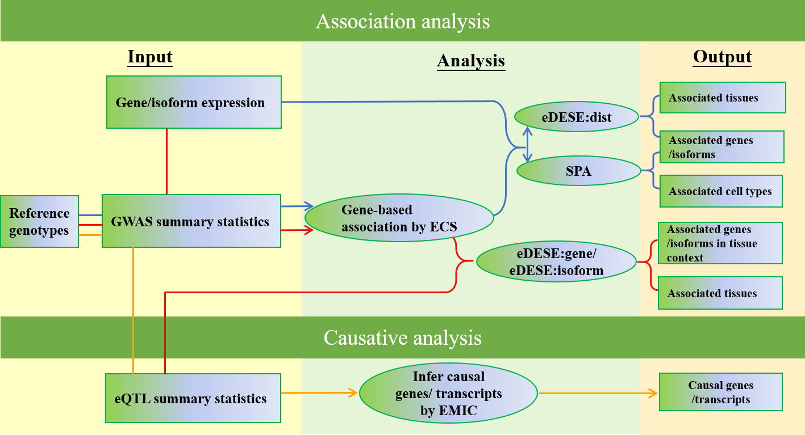

.. raw:: html

    

        KGGSEE: A biological Knowledge-based mining platform for Genomic and Genetic association Summary statistics using gEne Expression
    

.. centered:: User manual 1.0
.. centered:: Miaoxin Li, Lin Jiang, Xiangyi Li

1 Introduction
==============
KGGSEE is a standalone Java tool for knowledge-based analyses and can perform association analysis and causative inference analysis based on the genomic and genetic association summary statistics of complex phenotypes, gene expression profiles and related data. It can perform four major integrative analyses:

- Gene-based association analysis; 

- Estimate phenotype-associated tissues or cell-type based on gene expression of single-cell or bulk cells in different tissues; 

- Conditional gene-based association analysis based on an improved effective chi-squared statistic (ECS) and multiple variant-gene mapping strategies; 

- Causal gene inference for complex diseases and traits based on multiple eQTLs. 

More integrative analysis functions will be added to KGGSEE in the future.

2 Installation
==============

2.1 kggsee.jar
~~~~~~~~~~~~~~~

The main library of KGGSEE, kggsee.jar, does not need an installation procedure as long as its `Java Runtime Environment(JRE) v1.8 <https://www.oracle.com/java/technologies/javase-jre8-downloads.html>`_ (or up) is pre-installed in your machine. The kggsee.jar can be directly executed given a file path.

..
 2.2 R packages
 ~~~~~~~~~~~~~

 User may need to install three R packages which will be called by KGGSEE. The following are the instructions for R package installation under the interactive working interface of R.

 - Rserve

     ``install.packages(“Rserve”, dep=TRUE)``
     More installation instructions can be found at https://www.dundas.com/support/support-center/support-articles/installation/install-and-configure-r.

 - NNLM

     ``install.packages(“NNLM”, dep=TRUE)``
     More installation instructions can be found at https://github.com/linxihui/NNLM.

 - MendelianRandomization

     The first step is to install the PhenoScanner package(and the MendelianRandomization package if you haven't done this previously):

     .. code:: R

         install.packages("devtools")
         library(devtools)
         install_github("phenoscanner/phenoscanner")
         library(phenoscanner)

         install.packages("MendelianRandomization")
         library(MendelianRandomization)

2.2 Resource data
~~~~~~~~~~~~~~~~~~

In the KGGSEE working folder, a folder named **resources** contains the running resource data, e.g., gene boundary and gene expression. KGGSEE will automatically download the required resource files to this folder. Users can also manually download all the files and put them into the corresponding folders.

3 Tutorials
===========

3.1 Gene-based association analysis
~~~~~~~~~~~~~~~~~~~~~~~~~~~~~~~~~~~
Purpose: Detect the phenotype-associated genes of a phenotype using the GWAS summary statistics.
   - Input data:
     
   1. GWAS summary statistics compressed in a text file (a fabled data set for education purposes): *examples/gwas.sum.stat.gz*
     
   2. Genotypes in VCF format to approximate the correction between summary statistics: *resources/hg19/gty/1kg.phase3.v5.shapeit2.eur.hg19.chr1.vcf.gz*

   .. code:: shell 

      java -Xmx10g -jar kggsee.jar \
      --nt 10 \
      --gene-assoc \
      --sum-file examples/gwas.sum.stat.gz \
      --vcf-ref resources/hg19/gty/1kg.phase3.v5.shapeit2.eur.hg19.chr*.vcf.gz \
      --keep-ref \  
      --out examples/out/geneAssoc
**Important Note:** The parameter of "--vcf-ref" is the genotypes in VCF format and can be downloaded from https://pmglab.top/genotypes/#/. The users should download the proper vcf files according to their research subjects' ancestry. The combination of "--vcf-ref" and "--keep-ref" can keep the parsed vcf data (KGGSEE object format) in a local folder named like "VCFRefhg19" under the output folder (here is the "examples/out/geneAssoc"). When the users want to run another analysis, the users can use the option "--saved-ref" instead of the "--vcf-ref" and "keep-ref" to save time. The parameter of "--saved-ref" is the full path of folder "VCFRefhg19" (see example in the following part).

3.2 Estimate the phenotype-associated cell-types of a phenotype
~~~~~~~~~~~~~~~~~~~~~~~~~~~~~~~~~~~~~~~~~~~~~~~~~~~~~~~~~~~
  
Purpose: Estimate the relevant cell-types of a phenotype and finely map associated genes according to selective expression.
   - Input data:
    
   1. GWAS summary statistics compressed in a text file(a fabled data set for education purposes): *examples/gwas.sum.stat.gz*
     
   2. Genotypes in KGGSEE objects(generated in `Gene-based association analysis <#gene-based-association-analysis>`_) to approximate the correction between summary statistics: *examples/out/geneAssoc*
     
   3. Gene expression data compressed in a text file: *resources/hs_scRNA_cluster_mean.tsv.gz*
     
   .. code:: shell

      java -Xmx10g -jar kggsee.jar \
      --nt 10 \
      --gene-finemapping \
      --expression-file resources/hs_scRNA_cluster_mean.tsv.gz \
      --only-hgnc-gene \
      --sum-file examples/gwas.sum.stat.gz \
      --saved-ref  examples/out/geneAssoc \
      --out examples/out/spa \
      --excel
      

3.3 Conditional gene-based association analysis with eDESE
~~~~~~~~~~~~~~~~~~~~~~~~~~~~~~~~~~~~~~~~~~~~~~~~~~~~~~~~~~

Purpose: Perform conditional gene-based association analysis using different strategies to map variants to genes, i.e., physically nearby variants, gene-level and isoform-level eQTLs (also are variants). Three strategies correspond to three models, i.e., eDESE:dist, eDESE:gene and eDESE:isoform, respectively.
  
**eDESE:dist**

- Input data:
     
1. GWAS summary statistics compressed in a text file (a fabled data set for education purposes): *examples/gwas.sum.stat.gz*;
     
2. Genotypes in KGGSEE objects (generated in `Gene-based association analysis <#gene-based-association-analysis>`_) to approximate the correction between summary statistics: *examples/out/geneAssoc*;
   
3. Gene expression data compressed in a text file: *resources/gtex.v8.gene.mean.tsv.gz*. We have provided the dataset based on the gene-expression profiles of ~50 tissues in GTEX(v8) and has been packaged this file in the download of "KGGSEE+Resources" at http://pmglab.top/kggsee/#/download. Users can also use their own gene expression profiles. The row index is gene name, and the column name is tissue name and tissue name +".SE". Each tissue has two columns, one representing the average expression value of all samples of the tissue and the other representing the standard error of the mean (SE).
   
  
   .. code:: shell

      java -Xmx20g \
      -jar kggsee.jar \
      --nt 10 \
      --sum-file examples/gwas.sum.stat.gz \
      --chrom-col CHR \
      --pos-col BP \
      --p-col P \
      --gene-finemapping \
      --saved-ref  examples/out/geneAssoc \
      --expression-file resources/gtex.v8.gene.mean.tsv.gz \
      --only-hgnc-gene \
      --p-value-cutoff 0.05 \
      --multiple-testing bonf \
      --calc-selectivity \
      --regions-out chr6:27477797-34448354 \
      --out examples/out/geneAssoceQTL
      

**eDESE:gene**

- Input data:
     
1. The GWAS summary statistics compressed in a text file(a fabled data set for education purposes): *examples/gwas.sum.stat.gz*;     
2. Genotypes in KGGSEE objects to approximate the correction between summary statistics (generated in `Gene-based association analysis <#gene-based-association-analysis>`_): *examples/out/geneAssoc*;
3. Gene-level expression data compressed in a .gz or text file: *resources/gtex.v8.gene.mean.tsv.gz*. We have provided the dataset based on the gene-expression profiles of ~50 tissues in GTEX(v8) and has been packaged this file in the download of "KGGSEE+Resources" at http://pmglab.top/kggsee/#/download. Users can also use their own gene expression profiles.
4. eQTLs data compressed in a gz or text file: *resources/hg19/eqtl/Brain-FrontalCortex_BA9_.gene.maf05.p01.gz.eqtl.txt.gz*. Our pre-calculated gene-level eQTLs based on GTEx(v8) can be downloaded from https://figshare.com/articles/dataset/EUR_gene_eqtl_hg19_tar_gz/16959604.
   
   .. code:: shell

      java -Xmx20g \
      -jar kggsee.jar \
      --nt 10 \
      --chrom-col CHR \
      --pos-col BP \
      --p-col P \
      --gene-finemapping \
      --sum-file examples/gwas.sum.stat.gz \
      --saved-ref  examples/out/geneAssoc \
      --expression-file resources/gtex.v8.gene.mean.tsv.gz \
      --eqtl-file resources/hg19/eqtl/Brain-FrontalCortex_BA9_.gene.maf05.p01.gz.eqtl.txt.gz \
      --filter-eqtl-p 0.01 \  
      --only-hgnc-gene \
      --p-value-cutoff 0.05 \
      --multiple-testing bonf \
      --calc-selectivity \
      --regions-out chr6:27477797-34448354 \
      --out examples/out/geneAssoceQTL

**eDESE:isoform**

- Input data:
     
1. The GWAS summary statistics compressed in a text file(a fabled data set for education purposes): *examples/gwas.sum.stat.gz*;
     
2. Genotypes in KGGSEE objects to approximate the correction between summary statistics(generated in `Gene-based association analysis <#gene-based-association-analysis>`_): *examples/out/geneAssoc*;

3. Isoform-level expression data compressed in a .gz or text file: *resources/gtex.v8.transcript.mean.tsv.gz*. We have provided the dataset based on the isoform/transcript-expression profiles of ~ 50 tissues in GTEX(v8) and has been packaged this file in the download of "KGGSEE+Resources" at http://pmglab.top/kggsee/#/download. Users can also use their own isoform-level expression profiles.

4. IsoQTL data compressed in a gz or text file: *resources/hg19/eqtl/Brain-FrontalCortex_BA9_.transcript.maf05.p01.gz.eqtl.txt.gz*.Our pre-calculated isoform-level eQTLs based on GTEx(v8) can be downloaded from https://figshare.com/articles/dataset/EUR_transcript_eqtl_hg19_tar_gz/16959616. 

   .. code:: shell

      java -Xmx20g \
      -jar kggsee.jar \
      --nt 10 \
      --sum-file examples/gwas.sum.stat.gz \
      --chrom-col CHR \
      --pos-col BP \
      --p-col P \
      --gene-finemapping \
      --saved-ref  examples/out/geneAssoc \
      --expression-file resources/gtex.v8.transcript.mean.tsv.gz \
      --eqtl-file resources/hg19/eqtl/Brain-FrontalCortex_BA9_.transcript.maf05.p01.gz.eqtl.txt.gz \ 
      --filter-eqtl-p 0.01 \  
      --only-hgnc-gene \
      --p-value-cutoff 0.05 \
      --multiple-testing bonf \
      --calc-selectivity \
      --regions-out chr6:27477797-34448354 \
      --out examples/out/geneAssoceQTL

 
3.4 Gene-based causality analysis
~~~~~~~~~~~~~~~~~~~~~~~~~~~~~~~~~

Purpose: Detect the causal genes of a phenotype using the GWAS summary statistics and eQTL.
   - Input data:

   1. GWAS summary statistics compressed in a text file(a fabled data set for education purpose): *examples/gwas.sum.stat.gz*
   
   2. Genotypes in KGGSEE objects(generated in `Gene-based association analysis <#gene-based-association-analysis>`_) to approximate the correction between summary statistics: *examples/out/geneAssoc*
   
   3. eQTL summary statistics compressed in a text file: *resources/hg19/eqtl/Brain-FrontalCortex_BA9_.transcript.maf05.p05.gz.eqtl.txt.gz*
     
   .. code:: shell  

      java -Xmx10g  -jar kggsee.jar \
      --nt 10 \
      --emic \
      --eqtl-file resources/hg19/eqtl/Brain-FrontalCortex_BA9_.transcript.maf05.p05.gz.eqtl.txt.gz \
      --sum-file examples/gwas.sum.stat.gz \
      --beta-type 2 \
      --saved-ref  examples/out/geneAssoc \
      --out examples/out/emic \
      --excel
 
3.5 Drug selective perturbation analysis for drug repositioning analysis (SelDP)
~~~~~~~~~~~~~~~~~~~~~~~~~~~~~~~~~~~~~~~~~~~~~~~~~~~~~~~~~~~~~~~~~~~~~~~~~~~~~~~~
Purpose: Estimate the drug selective perturbation effect on the phenotype-associated genes' expression to aid the drug repositioning for complex diseases.

  - Input data:  
  
    1. GWAS summary statistics compressed in a text file(a fabled data set for education purpose): *examples/gwas.sum.stat.gz*;
   
    2. Genotypes in KGGSEE objects(generated in `Gene-based association analysis <#gene-based-association-analysis>`_) to approximate the correction between summary statistics: *examples/out/geneAssoc*;
   
    3. Drug/compound-induced gene expression fold changes (log2(Treated/Control)) profiles. We provided an example of drug-induced fold changes based on the Level 3 data of LINCS 2017 release) at ...;
   
    4. eQTL data of phenotype-associated tissues. The eQTL-guided drug selective perturbation analysis need the eQTL data as one of the inpput dataset. We have procalculated the gene-level and transcript-level eQTL data based on the GTEx (v8), and the eQTL data can be accessed at https://figshare.com/articles/dataset/EUR_gene_eqtl_hg19_tar_gz/16959604 and  https://figshare.com/articles/dataset/EUR_transcript_eqtl_hg19_tar_gz/16959616.
   
   The original SelDP:
   
   .. code:: shell  
   
      java -Xmx20g \
      -jar kggsee.jar \
      --nt 10 \
      --sum-file examples/gwas.sum.stat.gz \
      --chrom-col CHR \
      --pos-col BP \
      --p-col P \
      --gene-finemapping \
      --saved-ref  examples/out/geneAssoc \
      --expression-file drug-induced.gene.expression.fold.change.profile \
      --only-hgnc-gene \
      --p-value-cutoff 0.05 \
      --multiple-testing bonf \
      --calc-selectivity \
      --regions-out chr6:27477797-34448354 \
      --out examples/out/Selective_Perturbed_Drugs
      
   The eQTL-guided SelDP:
   
   .. code:: shell

      java -Xmx20g \
      -jar kggsee.jar \
      --nt 10 \
      --chrom-col CHR \
      --pos-col BP \
      --p-col P \
      --gene-finemapping \
      --sum-file examples/gwas.sum.stat.gz \
      --saved-ref  examples/out/geneAssoc \
      --expression-file drug-induced.gene.expression.fold.change.profile \
      --eqtl-file resources/hg19/eqtl/Brain-FrontalCortex_BA9_.gene.maf05.p01.gz.eqtl.txt.gz \
      --filter-eqtl-p 0.01 \  
      --only-hgnc-gene \
      --p-value-cutoff 0.05 \
      --multiple-testing bonf \
      --calc-selectivity \
      --regions-out chr6:27477797-34448354 \
      --out examples/out/Selective_Perturbed_Drugs
 
4 Functions
===========

4.1 Gene-based association analysis by an effective chi-square statistics(ECS)
~~~~~~~~~~~~~~~~~~~~~~~~~~~~~~~~~~~~~~~~~~~~~~~~~~~~~~~~~~~~~~~~~~~~~~~~~~~~~~

One can perform the gene-based association analysis by an effective chi-square statistics (ECS) with the GWAS *p*-values of variants. The *p*-values are converted to chi-square statistics(degree of freedom = 1). The ECS merges all chi-square statistics of a gene after correcting the redundancy of the statistics due to LD. The LD is calculated from genotypes of an ancestrally matched sample in VCF format, e.g., a panel of 1000 Genomes Project. The method of ECS is described in our paper(`Paper Link <http://bing.com>`_).

Required options
----------------

- ``--gene-assoc``
- ``--sum-file [/path/to/summary/file]``
- ``--vcf-ref [/path/to/vcf/file]``
- ``--keep-ref``
- ``[--saved-ref "previous/output/path/prefix"]``
- ``--out [output/path/prefix]``

**See an analysis example at:** `Gene-based association analysis <#gene-based-association-analysis>`_

Explanations and Optional options
---------------------------------

- ``--gene-assoc``: The main function option.
- ``--sum-file``: The file containing GWAS summary statistics.

    Three columns of the GWAS summary statistic file, i.e., chromosome, physical position and *p*-value are a minimal requirement. The default column names are CHR, BP and P, respectively. Otherwise, users should specify the name by using ``--chrom-col``, ``--pos-col`` and ``--p-col``, respectively.

    .. table::
        :align: center

        === ====== ======
        CHR BP     P
        === ====== ======
        1   751756 0.979957
        1   752566 0.863844
        1   752894 0.55814
        1   753405 0.968401
        1   755890 0.918246
        === ====== ======

- ``--vcf-ref``: The file containing the genotypes to calculate the genotypic correlations. For the data separated in multiple files by chromosomes, one can use the asterisk wildcard (e.g., hg19.chr*.vcf.gz) to denote the chromosome names.
- ``--keep-ref``: If used, the option will enable to save the encoded genotypes in VCF for future usage, which will speed up the next analysis.
- ``--saved-ref``: Instead of using ``--vcf-ref``, one can directly specify the path of the encoded genotypes generated last time by specifying the last output path.
- ``--filter-maf-le``: Filter out the variants with minor allele frequency less or equal than the specified value.
- ``--out``: Specify the path and prefix name of the output files. The main output file of the gene-based analysis is ***.gene.pvalue.txt** or ***.gene.pvalue.xls**. The following is an example:

    .. csv-table::
        :file: ./table/demo.gene.pvalue.csv
        :header-rows: 1
        :align: center

    Columns in the output file are gene symbol, the number of variants in the gene, *p*-values of gene-based association test, and the detailed information of the top variant within the gene(i.e., the variant with the smallest *p*-value). These columns include chromosome, physical position, *p*-value, whether the top variant was ignored in the gene-based association analysis, and gene feature annotations according to RefGene and GENCODE.

4.2 Finely map genes and estimate relevant cell types of a phenotype by the single-cell (or bulk-cell) type and phenotype cross annotation framework(SPA)
~~~~~~~~~~~~~~~~~~~~~~~~~~~~~~~~~~~~~~~~~~~~~~~~~~~~~~~~~~~~~~~~~~~~~~~~~~~~~~~~~~~~~~~~~~~~~~~~~~~~~~~~~~~~~~~~~~~~~~~~~~~~~~~~~~~~~~~~~~~~~~~~~~~~~~~~

One can simultaneously prioritize phenotype-associated genes and cell types with GWAS *p*-values and gene/transcript expression profile. The GWAS *p*-values types and expression were analyzed by an iterative prioritization procedure. In the procedure, phenotype-associated genes were prioritized by a conditional gene-based association(using the ECS again) according to the genes’ selective expression in disease related cell-types while the phenotype related cell-types were prioritized by an enrichment analysis of Wilcoxon rank-sum test for phenotype-associated genes’ selective expression. The phenotype-associated gene list and phenotype related cell-type list were updated by turns until the two list were unchanged. The detailed method is described in our paper(`Paper Link <http://bing.com>`_).

Required options
-------------------

- ``--gene-finemapping``
- ``--expression-file [path/to/expression/file]``
- ``--only-hgnc-gene``
- ``--sum-file [/path/to/summary/file]``
- ``--saved-ref  [previous/output/path/prefix]``
- ``--out [output/path/prefix]``

**See an analysis example at:** `Estimate relevant cell-types of a phenotype <#estimate-relevant-cell-types-of-a-phenotype>`_

Explanations and Optional options
----------------------------------

- ``--gene-finemapping``: The main function option.
- ``--multiple-testing``: The multiple testing method to select significant genes for the conditional analysis. There are three settings. *bonf*: Standard Bonferroni correction given a family-wise error rate specified by ``--p-value-cutoff``.  *benfdr*: Benjamini-Hochberg method to control the false discovery rate. *fixed*: Filtering by a fixed *p*-value cutoff.
- ``--p-value-cutoff``: The cutoff for the multiple testing.
- ``--only-hgnc-gene``: Only consider genes with hgnc gene symbols.
- ``--expression-file``: The path of gene expression file.

    The expression file contains gene symbols(the first column), expression mean and standard errors of the gene or transcript in a cell types or clusters. One can include the Ensembl transcript ID of a gene in the first column. When a gene has multiple transcripts, each row can only contain the data of transcript. The standard error is not pre-requisite.

    .. csv-table::
        :file: ./table/gene.expression.file.csv
        :header-rows: 1
        :align: center

- ``--sum-file``: See above description. 
- ``--filter-maf-le``: See above description.
- ``--out``: Specify the path and prefix name of the output files. One of main output files is the conditional gene-based analysis results, named ***.finemapping.gene.ecs.txt** or ***. finemapping.gene.ecs.xls**. The following

    .. csv-table::
        :file: ./table/demo.finemapping.gene.ecs.csv
        :header-rows: 1
        :align: center

    columns in the output file are gene symbol, chromosome, transcription start position, transcription end position, number of variants in the gene, the LD group ID of genes, *p*-values of gene-based association test, *p*-values of conditional gene-based association test, and the selective expression score in enriched tissue or cell-types.

    Another main output files is the selective expression enrichment analysis results at different tissues or cell types, named ***.celltype.txt** or ***. celltype.xls**. The following

    .. csv-table::
        :file: ./table/demo.celltype.csv
        :header-rows: 1
        :align: center

    columns in the output file are tissue or cell-type names, the *p*-value of enrichment according to the selective expression derived from the robust regression *z*-score, the logarithm of *p*-value.

4.3 Multi-strategy Conditional Gene-based Association framework mainly guided by eQTLs (eDESE)
~~~~~~~~~~~~~~~~~~~~~~~~~~~~~~~~~~~~~~~~~~~~~~~~~~~~~~~~~~~~~~~~~~~~~~~~~~~~~~~~~~~~~~~~~~~~~

eDESE can be used to perform the conditional gene-based association analysis using different variant sets, i.e., physically nearby variants, gene-level and isoform-level eQTLs. The statistical method is the improved effective chi-square statistics (ECS). The pre-calculated gene-level and isoform-level eQTLs of 50 tissues or cell types from GTEx (v8) have been integrated into the KGGSEE resource (`hg19 <https://mailsysueducn-my.sharepoint.com/personal/limiaoxin_mail_sysu_edu_cn/_layouts/15/onedrive.aspx?originalPath=aHR0cHM6Ly9tYWlsc3lzdWVkdWNuLW15LnNoYXJlcG9pbnQuY29tLzpmOi9nL3BlcnNvbmFsL2xpbWlhb3hpbl9tYWlsX3N5c3VfZWR1X2NuL0VwWFJxTFhJVG9aSXRFclVIaURORE8wQmstamVpQXRJbEEtYWJHak9DZGJxRXc%5FcnRpbWU9OUt0dVZ1b0QyVWc&id=%2Fpersonal%2Flimiaoxin%5Fmail%5Fsysu%5Fedu%5Fcn%2FDocuments%2Ftools%2Fkggsee%2Fresources%2Fhg19%2Feqtl>`_ and `hg38 <https://mailsysueducn-my.sharepoint.com/personal/limiaoxin_mail_sysu_edu_cn/_layouts/15/onedrive.aspx?originalPath=aHR0cHM6Ly9tYWlsc3lzdWVkdWNuLW15LnNoYXJlcG9pbnQuY29tLzpmOi9nL3BlcnNvbmFsL2xpbWlhb3hpbl9tYWlsX3N5c3VfZWR1X2NuL0VwWFJxTFhJVG9aSXRFclVIaURORE8wQmstamVpQXRJbEEtYWJHak9DZGJxRXc%5FcnRpbWU9OUt0dVZ1b0QyVWc&id=%2Fpersonal%2Flimiaoxin%5Fmail%5Fsysu%5Fedu%5Fcn%2FDocuments%2Ftools%2Fkggsee%2Fresources%2Fhg38%2Feqtl>`_).

Required options
----------------

- ``--gene-finemapping``
- ``--eqtl-file [path/to/eQTL/file of genes or transcripts]``
- ``--filter-eqtl-p``
- ``--expression-file [path/to/expression/file]``
- ``--calcu-selectivity``
- ``--sum-file [/path/to/summary/file]``
- ``--filter-maf-le``
- ``--saved-ref  [previous/output/path]``
- ``--out [output/path/prefix]``
- ``--nt``
- ``--chrom-col``
- ``--pos-col``
- ``--p-col``
- ``--only-hgnc-gene``
- ``--p-value-cutoff``
- ``--multiple-testing``
- ``--regions-out``

**See analysis examples at:** `Conditional gene-based association analysis based on the improved ECS and multiple variant-gene mapping strategies <#Conditional gene-based association analysis based on the improved ECS and multiple variant-gene mapping strategies>`_

Explanations and Optional options
-----------------------------------

- ``--nt``: Specify the number of CPU cores used for the analysis.
- ``--gene-finemapping``: No parameters required. The main function option.
- ``--multiple-testing``: Specify the multiple testing methods to select significant genes for the conditional analysis. There are three settings, i.e., bonf: Standard Bonferroni correction, benfdr: Benjamini-Hochberg method to control the false discovery rate, fixed: Filtering by a fixed p-value cutoff.
- ``--p-value-cutoff``: Specify the family-wise cutoff for the multiple testing.
- ``--only-hgnc-gene``: No parameters required. If used, KGGSEE only considers the genes with HGNC gene symbols.
- ``--expression-file``: Specify the path of the preproceeded gene expression file. The index column of the preprocessed expression file was gene/isoform symbol name, and each of 50 tissues or cell types had two columns: one representing averaged expression value (i.e., mean) of all samples and the other representing the standard error of the mean (SE).
- ``--calcu-selectivity``: No parameters required. If used, KGGSEE will perform gene-based association analysis by conditioning on the gene-level/isoform-level expression profiles.

- ``--filter-eqtl-p``: Specify the filter to select the significant gene/isoform-level eQTLs to enter the following gene-based association analysis.
- ``--sum-file``: Specify the full path of the GWAS summary statistics. Three columns of the GWAS summary statistic file, i.e., chromosome, physical position and p-value are minimally required. The default column names are CHR, BP and P, respectively. Users can also specify these names by using ``--chrom-col``, ``--pos-col`` and ``--p-col``, respectively.
- ``--filter-maf-le``: Specify the filter used to select the variants with MAF > the cutoff to enter the following gene-based association analysis.
- ``--regions-out``: Location section, such as chr6:27477797-34448354. Specify the variants in the specified regions to be excluded in the following gene-based association analysis.

- ``--eqtl-file``: Specify the full path of gene-level and isoform-level eQTL file. The format of the eQTL file is similar to the fasta file. The first row starting with "#" is the column name. Then the eQTL data of a gene or transcript starts with the symbol “>”, and the following are the gene symbol, Ensembl gene/transcript ID and chromosome name, which are delimited by tab characters. The subsequent rows contain the summary statistics of the eQTL-gene/isoform association. The tab-delimited columns are physical position, reference allele, alternative allele, frequency of alternative allele, estimated effect size, standard error of the estimation, *p*-value, effective sample sizes and determination coefficient in linear regression, respectively. In the regression, the number of alternative alleles is used as an independent variable. Based on KGGSEE, we have pre-calculated the eQTL data using the GTEx data(v8). Variants within 1MB upstream and downstream of a gene or a transcript boundary are included. The commands to compute eQTLs can be seen in `Compute the gene-level and isoform-level eQTLs of each tissue <#compute-the-eqtls-and-isoqtls-of-each-tissue>`_.
    
    An example of gene-level eQTLs file is as follows:

    .. code::

        #symbol id	chr	pos	ref	alt	altfreq	beta	se	p	neff	r2
        >WASH7P	ENSG00000227232	1
        52238	T	G	0.942	-1.771	0.285	5.16E-10	65	0.38
        74681	G	T	0.95	-1.457	0.333	1.19E-5	63	0.239
        92638	A	T	0.241	0.547	0.206	7.93E-3	53	0.121
        >MIR1302-10	ENSG00000284557	1
        52238	T	G	0.942	-1.771	0.285	5.16E-10	65	0.38
        74681	G	T	0.95	-1.457	0.333	1.19E-5	63	0.239
         …	…	…	…	…	…	…	…	…
        
    An example of isoform-level eQTLs file is as follows:
 
    .. code::
 
        #symbol id      chr     pos     ref     alt     altfreq beta    se      p       neff    r2
        >DDX11L1	ENST000456328	1						
        13418	G	A	0.161	-0.03	0.013	0.027	62	0.076
        19391	G	A	0.11	0.065	0.027	0.017	63	0.085
        107970	G	A	0.285	-0.024	0.01	0.018	86	0.063
        >MIR6859	ENST0000612080	1						
        13418	G	A	0.161	-0.03	0.013	0.027	62	0.076
        19391	G	A	0.11	0.065	0.027	0.017	63	0.085
        62578	G	A	0.081	0.062	0.024	7.98E-03	67	0.098
        99334	A	G	0.088	0.071	0.035	0.043	56	0.07
        …	…	…	…	…	…	…	…	…

- ``--out``: Specify the path and prefix name of the output files. 

    + For eDESE, the six output files are as follows:
    
        - The first output file is the conditional gene-based analysis results, named ***.finemapping.gene.ecs.txt** or ***.finemapping.gene.ecs.xls** (We get the susceptible genes based on this file). 

        .. csv-table::      
           :file: ./table/eDESE_demo.finemapping.gene.ecs.csv
           :header-rows: 1
           :align: center

        Gene: gene name;

        Chrom: chromosome position of the gene;
        
        StartPos: gene start position (refGene hg19);
        
        EndPos: gene end postion (refGene hg19);
        
        #Var: the number of variants assigned to the gene according to different strategies (physically nearby variants for eDESE:dist, gene-level eQTLs (also are variants) for eDESE:gene, isoform-level eQTLs (also are variants) for eDESE:isoform);
        
        Group: the identifier of LD block to which the gene belongs;

        ECSP: the p-value of effective chi-square test (without conditioning on gene expression profiles);

        CondiECSP: the p-value of the gene by performing the conditional effective chi-square test;

        GeneScore: the tissue-selective score of the gene by the end of the iterative procedure; 
        
    
        - The second output file is the gene-based association result file ("gene-top variant" ECS result), named ***.gene.pvalue.txt** or ***.gene.pvalue.xls**.
       
        .. csv-table::
           :file: ./table/eDESE_demo.gene.pvalue.csv
           :header-rows: 1
           :align: center
        
        
        Gene: gene name;
       
        #Var: the number of variants assigned to the gene according to different strategies (physically nearby SNPs for eDESE:dist, gene-level eQTLs (also are variants) for eDESE:gene, isoform-level eQTLs (also are variants) for eDESE:isoform);
        
        ECSP: the p-value of effective chi-square test (without conditioning on gene expression profiles);
        
        Chrom: chromosome position of the gene;
        
        Pos: the position of top-variant belonging to the gene;
        
        GWAS_Var_P: the p-value of the top-variant in GWAS summary statistics.
        
        Especially, additional three columns are appended to the ***.gene.pvalue.txt** or ***.gene.pvalue.xls** generated by eDESE:gene and eDESE:isoform (see example below).
        
        .. csv-table::
           :file: ./table/eDESE_gene.gene.pvalue.csv
           :header-rows: 1
           :align: center
        
        eQTL_P: the variant-gene expression association p-value of the top-variant with the gene;
        
        eQTL_Beta: the variant-gene expression association beta value of the top-variant with the gene;
        
        eQTL_SE: the standard error of the mean of beta value.
        
        - The third output file is the p-value of all variants belonging to a gene (raw ECS results), named ***.gene.var.pvalue.txt.gz**. Their file formats are the same as above. The meaning of the column names in ***.gene.var.pvalue.txt.gz** is the same as that in ***.gene.pvalue.txt**.
 
        .. csv-table::
           :file: ./table/eDESE_demo.gene.var.pvalue.csv
           :header-rows: 1
           :align: center

        
        - The fourth output file is the significance of phenotype-associated tissues, named ***.celltype.txt**.
     
        .. csv-table::
           :file: ./table/eDESE_demo.celltype.csv
           :header-rows: 1
           :align: center
     
     
        TissueName: tissue names;
     
        RobustRegressionZ: The p-value generated by the Wilcoxon rank-sum test based on the robust-regression z-score of the potential susceptibility and non-susceptibility genes.
     
        AveragedLog(p): the negative log10 of the p-values generated by averaging the p-values of four selective-expression measures (robust-regression z-score, conventional z-score, MAD robust z-score, and ratio of vector-scalar projection).
     
      - The fifth output file is a Q-Q plot, named ***.qq.png**, representing the p-value of the ECS test based on gene, variants insides the gene and variants outside the gene, respectively.

      - The sixth output file is the log file in which the detailed parameter settings and computation procedures can be found.

4.4 Infer the causal genes based on GWAS summary statistics and eQTLs by Mendelian randomization analysis framework for causal gene estimation(EMIC)
~~~~~~~~~~~~~~~~~~~~~~~~~~~~~~~~~~~~~~~~~~~~~~~~~~~~~~~~~~~~~~~~~~~~~~~~~~~~~~~~~~~~~~~~~~~~~~~~~~~~~~~~~~~~~~~~~~~~~~~~~~~~~~~~~~~~~~~~~~~~~~~~~~~~

One can perform multiple IVs-based MR analyses to infer the causal genes or transcripts by using the integrative framework named EMIC. EMIC adopted two multiple IVs-based MR methods for causality test and casual effect estimation of a gene’s expression to a phenotype, median-based MR and ML-based MR. EMIC needs two major inputs, GWAS and eQTL summary statistics, respectively. The GWAS summary statistics refer to the logarithm of odds ratio or regression coefficients and the corresponding standard errors(SEs) from a large-scale GWAS study, indicating the association between IVs and a phenotype. The eQTL summary statistics are similar to that of the GWAS, indicating the association between IVs and the expression of genes or transcripts in a tissue or cell type. EMIC has integrated the pre-calculated cis-eQTLs in 50 tissues or cell-types with gene-level and isoform-level expression from GTEx(version 8).

Required options
---------------------

- ``--emic``
- ``--eqtl-file [path/to/eQTL/file of genes or transcripts]``
- ``--sum-file [/path/to/summary/file]``
- ``--beta-type [0/1/2]``
- ``--saved-ref  [previous/output/path]``
- ``--out [output/path/prefix]``

**See an analysis example at:** `Gene-based causality analysis <#gene-based-causality-analysis>`_

Explanations and Optional options
---------------------------------------

- ``--emic``: No parameters required. The main function option.
- ``--eqtl-file``: See above description.
- ``--sum-file``: See above description.
- ``--beta-type``: The altenative values are 0, 1 or 2. Specially, 0 represents the coefficients of linear regression for a quantitative phenotype; 1 represents the coefficients of logistic regression or the logarithms of odds ratio for a qualitative phenotype; 2 represents the odds ratio for a qualitative phenotype.
- ``--saved-ref``: See above description.
- ``--out``: Specify the path and prefix name of the output files. The main output file is the Mendelian randomization analysis results for causal gene estimation, named ***.mr.gene.txt** or ***. gene.mr.gene.xls**. The following

    .. csv-table::
        :file: ./table/demo.mr.gene.csv
        :header-rows: 1
        :align: center

    Columns in the output file are gene symbol, the number of variants in the gene, *p*-values of causality tests by Median-based MR, detailed causality estimation by Median-based MR, *p*-values of causality tests by maximal likelihood-based MR, detailed causality estimation by maximal likelihood-based MR, chromosome, top GWAS variant position, *p*-value, beta and SE of the top GWAS variant, *p*-value, beta and SE of the top GWAS variant as an eQTL. When a gene has multiple transcripts, the detailed MR results will show MR analysis of all transcripts. Each MR analysis result has four components, the number IVs for the estimation, the estimated causal effect, the standard error of the estimation, and the *p*-values.
    
 
4.5 Compute the gene/isoform-level eQTLs of each tissue
~~~~~~~~~~~~~~~~~~~~~~~~~~~~~~~~~~~~~~~~~~~~~~~~~~~~~~~
  
**Purpose**: compute the gene/isoform-level eQTLs based on the gene-level expression and isoform-level expression profiles of the target tissue.

 - Input data:
     
   1. Genotypes in KGGSEE objects (generated in `Gene-based association analysis <#gene-based-association-analysis>`_). Here genotypes in GTEx v8 were used as example input. When computing the gene/isoform-level eQTLs of certain tissue, only subjects simultaneously containing the genotype data and expression data were used;
     
   2. Gene expression data of certain tissues corresponding to genotype data from the same subjects;
   
   3. Subject information, such as subject ID and subject-related covariates.
     
    .. code:: shell

        java -Xmx10g \
        -jar kggsee.jar \
        --nt 10 \
        --calc-eqtl \
        --expression-gty-vcf  path/to/vcf/file/of/subjects/with/expression \
        --gene-expression resources/Adipose-Subcutaneous.expression.subjectid.gene.fmt.gz \
        --expression-subjects path/to/subjectID/covariates.txt \
        --filter-eqtl-p 0.01 \
        --hwe-all 0.001 \
        --filter-maf-le 0.05 \
        --neargene 1000000 \
        --out /path/Adipose-Subcutaneous.gene.maf05.p01 \

        
Details of the options can be seen in `Options Index <#id18>`_.

5 Options Index
===============

5.1 Inputs/outputs
~~~~~~~~~~~~~~~~

    .. csv-table::
        :file: ./table/input.output.options.index.csv
        :header-rows: 1
        :align: center

5.2 Quality control
~~~~~~~~~~~~~~~~~~~

    .. csv-table::
        :file: ./table/quality.control.options.index.csv
        :header-rows: 1
        :align: center

5.3 Functions
~~~~~~~~~~~

    .. csv-table::
        :file: ./table/functions.options.index.csv
        :header-rows: 1
        :align: center

5.4 Utilities
~~~~~~~~~~~

    .. csv-table::
        :file: ./table/utilities.options.index.csv
        :header-rows: 1
        :align: center
